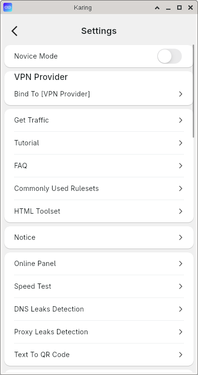
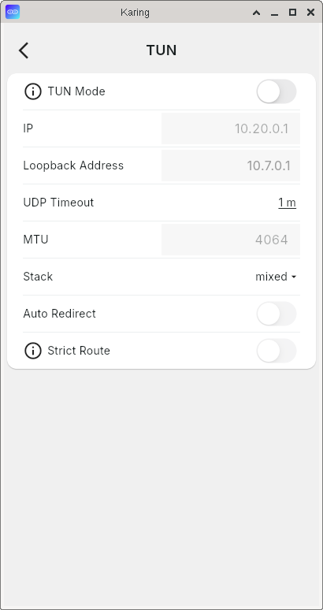
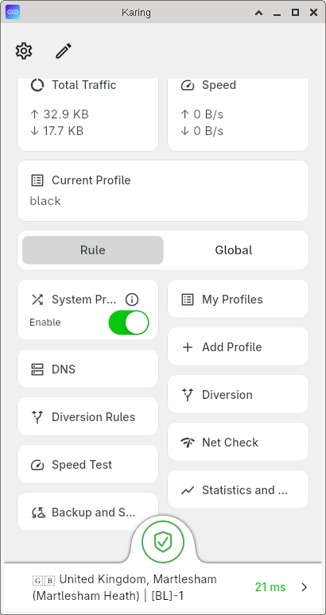
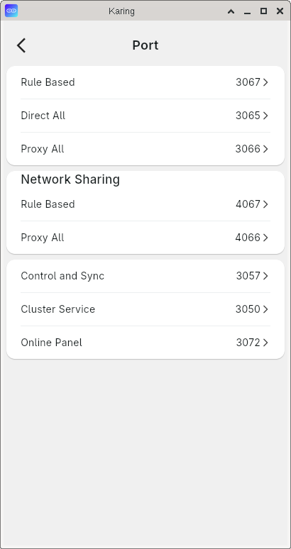
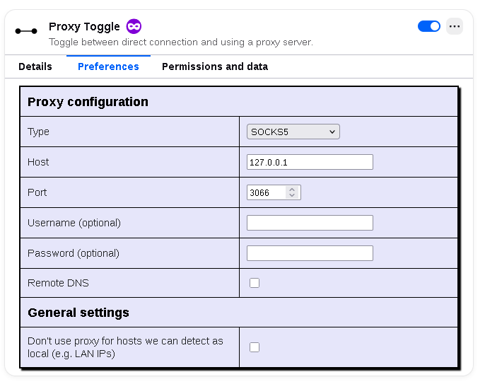

# Karing: Local SOCKS5 Proxy Setup (No Full Traffic Redirect)

This guide explains how to configure Karing to act as a local SOCKS5 proxy that routes traffic **only according to rules**, without forcing all system traffic through a remote server.

## Prerequisites

- Karing installed on your system
- Your proxy subscription or server configuration already added to Karing

## Step-by-Step Configuration

### 1. Disable "Newbie Mode"

First, turn off **Newbie Mode** to access advanced settings.

### 2. Turn Off TUN Mode (If Enabled)

TUN mode redirects all system traffic. Make sure it's disabled to prevent full traffic redirection.

### 3. Configure Network Sharing (Local SOCKS5 Proxy)

Go to **Settings → Network Sharing** and enable **"Allow other hosts to access"**. This turns Karing into a SOCKS5 proxy server.

- Note your local IP address shown here (e.g., `192.168.1.x`) - you'll need it for connections from other devices.

### 4. Disable System Proxy (Optional but Recommended)

If you don't want all system traffic proxied, make sure **System Proxy** is turned off.

> **Note:** The image shows it "on" - ensure yours is set to **OFF**.

### 5. Verify the SOCKS5 Port

Karing uses different ports for different routing modes:

| Port | Mode | Behavior |
|------|------|----------|
| **3066** | Full Proxy | Routes ALL traffic through remote server |
| **3067** | Rule-based | Routes ONLY traffic matching rules |
| 3065 | Full Direct | Routes NO traffic through proxy |

For local SOCKS5 proxy with selective routing, you'll use port **3066** with rule-based configuration.

> **Important:** Port `3066` shown above is for the SOCKS5 proxy. Ensure your routing rules are configured to use **Rule-based** mode, not "Global" or "Direct".

## How to Use the Proxy

Now that Karing is running as a local SOCKS5 proxy, configure your applications to use it:

### Firefox Proxy Toggle Setup

For quick and easy proxy switching in Firefox, use a proxy toggle extension (like FoxyProxy or Proxy SwitchyOmega). Configure it to use the local SOCKS5 proxy on port `3066`:

**Configuration values:**
- **Proxy Type:** SOCKS5
- **Proxy Host:** `127.0.0.1`
- **Port:** `3066`
- **DNS over SOCKS:** Enabled (recommended)

This allows you to toggle the proxy on/off with one click without digging into Firefox's network settings every time.

